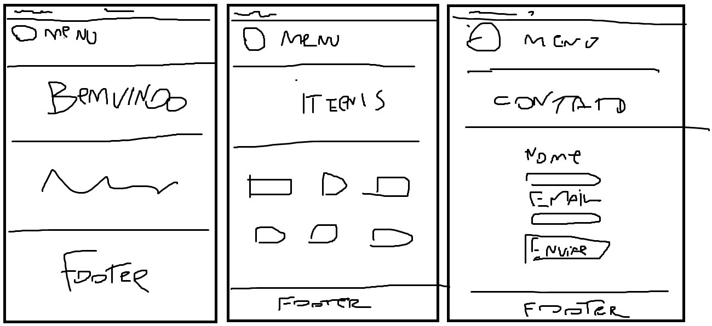
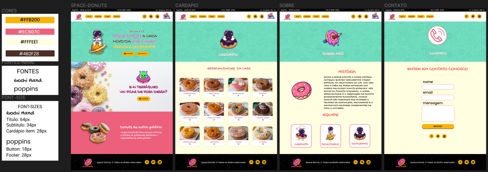

# AJUDE UM MICROEMPREENDEDOR ...

> PROJETO EM GRUPO RESILIA

 

## PREVIEW DO PROJETO 👀

[🔗 CLIQUE AQUI PARA ACESSAR](https://nobrupsiq.github.io/projeto-em-grupo-resilia/)

 

## 🛠 Utilizamos as seguintes Tecnologias

-   HTML
-   CSS
-   JAVASCRIPT
-   Git e Github
-   Figma

### HTML

-   Trabalhamos com acessibilidade utilizando `alt` nas imagens.
-   Utilizamos tags semânticas.

### CSS

-   Utilizamos `@import` para a organização de pastas.
-   Foram utilizados Pseudo Elements e Pseudo Classes `nth-child` e `after/before`
-   Utiliamos também `@media` para trabalhar na responsividade no projeto.

### JAVASCRIPT

-   Adicionamos um botão mobile que ativa/desativa o menu do site.
-   Fizemos uma pequena interação com o carrinho de compras na página `Cardápio` que ao clicar no botão de adicionar logo abaixo do produto `'+'` o valor `'de quantos foram clicados'` é adicionado ao carrinho
-   Também fizemos uma pequena validação de formulário que utiliza uma condição para verificar se o que o usuário está digitando combina com o pattern.

### REQUISITOS EXTRAS

-   Projeto totalmente responsivo ✔
-   Utilização de elementos semânticos no HTML ✔
-   Utilizar(Pull Request) no GitHub ✔

 

## BRAINSTORM DO GRUPO

> Tivemos várias idéias, pizzaria, doceria, loja de tênis, loja de roupas, loja de maquiagem. Mas a idéia definitiva apareceu durante a aula de Soft Skills da facilitadora Elizangela, onde foi passado um PDF na tela e notamos em uma das imagens o Homer simpson degustando um Donuts... E então conversamos sobre criar uma loja de Donuts e a votação foi unânime.

 

## RASCUNHO DO PROJETO ANTES DO FIGMA

## PROJETO JA MONTADO NO FIGMA

